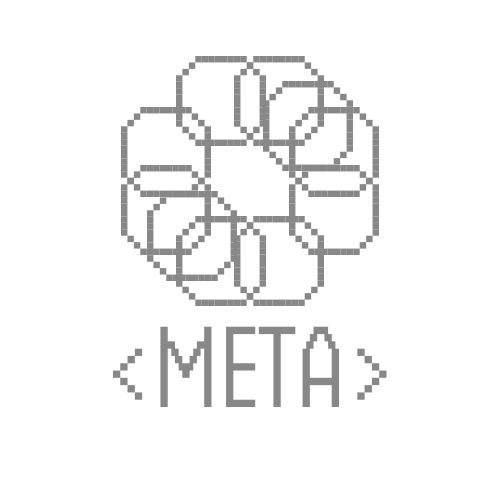

[![Contributors][contributors-shield]][contributors-url]
[![Forks][forks-shield]][forks-url]
[![Stargazers][stars-shield]][stars-url]
[![Issues][issues-shield]][issues-url]
[![MIT License][license-shield]][license-url]

<!-- PROJECT LOGO -->
 

  

<h3 align="center">Meta</h3>

  

    Meta is a compiler writing ecosystem optimized for speed and reliability. It is easy to pick up and extremely flexible.
     
    <a href="https://github.com/Continuum-AI-Inc/metalang/blob/main/docs/index.md"><strong>Explore the docs »</strong></a>
     
     
    <a href="https://github.com/Continuum-AI-Inc/metalang/issues">Report Bug</a>
    ·
    <a href="https://github.com/Continuum-AI-Inc/metalang/issues">Request Feature</a>
  

<!-- TABLE OF CONTENTS -->
- [About The Project](#about-the-project)
- [Getting Started](#getting-started)
- [Roadmap](#roadmap)
- [Contributing](#contributing)
- [License](#license)
- [Contact](#contact)

<!-- ABOUT THE PROJECT -->
## About The Project

Meta was inspired by [META-II developed in 1964 by D. V. Schorre](https://dl.acm.org/doi/10.1145/800257.808896). However, it was altered to suit the needs of modern-day compiler writing and is now almost unrecognizable as META-II.

Metalang features an easy-to-pickup [syntax](docs/syntax/index.md) and many extensions that make writing and testing compilers easier than ever.

It was used to write the compiler for [Gyro](https://github.com/Continuum-AI-Inc/gyro) and features the [METALS](docs/metals/index.md) specification for extended support with any language written in Metalang.

(<a href="#readme-top">back to top</a>)

<!-- GETTING STARTED -->
## Getting Started
`Meta` requires NPM and NodeJS to be installed on your system.
For faster execution speeds you may also want to consider installing [Gyro](https://github.com/Continuum-AI-Inc/gyro).

Take a look at the [getting started page](docs/getting-started.md) for further instructions.

(<a href="#readme-top">back to top</a>)

<!-- ROADMAP -->
## Roadmap

See the [open issues](https://github.com/Continuum-AI-Inc/metalang/issues) for a full list of proposed features (and known issues).

(<a href="#readme-top">back to top</a>)

<!-- CONTRIBUTING -->
## Contributing

Contributions are what make the open source community such an amazing place to learn, inspire, and create. Any contributions you make are **greatly appreciated**.

If you have a suggestion that would make this better, please fork the repo and create a pull request. You can also simply open an issue with the tag "enhancement".
Don't forget to give the project a star! Thank you!

1. Fork the Project
2. Create your Feature Branch (`git checkout -b feature/AmazingFeature`)
3. Commit your Changes (`git commit -m 'Add some AmazingFeature'`)
4. Push to the Branch (`git push origin feature/AmazingFeature`)
5. Open a Pull Request

(<a href="#readme-top">back to top</a>)

<!-- LICENSE -->
## License

Distributed under the MIT License. See `LICENSE` for more information.

<!-- CONTACT -->
## Contact

Moritz Utcke - [@Moritz Utcke](https://www.linkedin.com/in/moritz-utcke-5677a3184/) - moritz.utcke@gmx.de

<!-- MARKDOWN LINKS & IMAGES -->
<!-- https://www.markdownguide.org/basic-syntax/#reference-style-links -->
[contributors-shield]: https://img.shields.io/github/contributors/Continuum-AI-Inc/metalang.svg?style=for-the-badge
[contributors-url]: https://github.com/Continuum-AI-Inc/metalang/graphs/contributors
[forks-shield]: https://img.shields.io/github/forks/Continuum-AI-Inc/metalang.svg?style=for-the-badge
[forks-url]: https://github.com/Continuum-AI-Inc/metalang/network/members
[stars-shield]: https://img.shields.io/github/stars/Continuum-AI-Inc/metalang.svg?style=for-the-badge
[stars-url]: https://github.com/Continuum-AI-Inc/metalang/stargazers
[issues-shield]: https://img.shields.io/github/issues/Continuum-AI-Inc/metalang.svg?style=for-the-badge
[issues-url]: https://github.com/Continuum-AI-Inc/metalang/issues
[license-shield]: https://img.shields.io/github/license/Continuum-AI-Inc/metalang.svg?style=for-the-badge
[license-url]: https://github.com/Continuum-AI-Inc/metalang/blob/master/LICENSE.txt
[product-screenshot]: images/screenshot.png